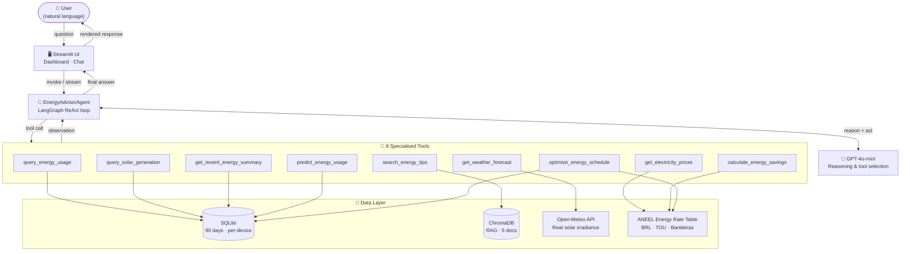

# EcoHome Energy Advisor


> AI-powered energy advisor for Brazilian households. Ask in natural language: *"Should I charge my Tesla now or wait for solar generation?"* The agent reasons over real consumption data, live weather, and ANEEL energy rates to give a grounded, quantified answer.


---

## Quick Start

```bash
git clone https://github.com/FabioCLima/Energy-Advisor-Project.git
cd Energy-Advisor-Project
echo "OPENAI_API_KEY=sk-..." > .env
docker compose up
```

Open **http://localhost:8501** — dashboard loads with 90 days of sample data pre-populated.

> No Docker? See [manual setup](#manual-setup) below.

---

## Run the API (FastAPI + LangServe)

```bash
uv run uvicorn energy_advisor.api.app:app --reload --port 8000
```

Open:
- **http://localhost:8000/docs** (OpenAPI)
- **http://localhost:8000/advisor/playground/** (LangServe playground)

LangServe endpoints are exposed under `POST /advisor/invoke` and `POST /advisor/stream`.

---

## The Problem

Brazilian households with solar panels, EVs, and home offices face three disconnected data sources:
- **Energy bills** (kWh and BRL, with ANEEL bandeira surcharges that change monthly)
- **Solar generation** (depends on irradiance — weather changes everything)
- **Usage patterns** (EV charges at night, home office runs 9–18h, AC peaks in summer)

Manually cross-referencing these to answer "what's the cheapest time to charge my car today?" is impossible without tooling. EcoHome automates that reasoning.

---

## What the Agent Does

The LangGraph ReAct agent coordinates **9 specialized tools** and reasons over multiple sources before responding:

| Tool | Data source | What it enables |
|---|---|---|
| `query_energy_usage` | SQLite (90 days, per-device) | "How much did my AC cost last week?" |
| `query_solar_generation` | SQLite (hourly generation) | "When did my panel produce the most?" |
| `get_electricity_prices` | ANEEL TOU + bandeira table | "What's the current energy rate?" |
| `get_weather_forecast` | **Open-Meteo API** (real data) | "Will solar generate enough this afternoon?" |
| `search_energy_tips` | ChromaDB RAG (5 documents) | "Best practices for EV charging?" |
| `calculate_energy_savings` | Savings math engine | "How much would I save shifting to off-peak?" |
| `get_recent_energy_summary` | SQLite aggregate | Context for open-ended questions |
| `predict_energy_usage` | SQLite + baseline/ML model artifact | "What will my usage look like tomorrow?" |
| `optimize_energy_schedule` | Forecast router + pricing + heuristics | "What should I shift to save over the next 30 days?" |

**Example exchange:**

> **User:** Vale a pena ligar o ar-condicionado agora?
>
> **Agent:** Agora (15h) você está em horário mid-peak (R$ 0,6560/kWh) com irradiância solar moderada de 197 W/m² — seu painel está gerando parcialmente. O custo real do AC é de ~R$ 0,35/h com o offset solar. Se esperar até as 18h, o pico sobe para R$ 0,987/kWh. **Recomendação: ligue agora, antes do horário de ponta.**

---

## Architecture



Six-layer design — each layer testable and replaceable independently:

| Layer | Component | Role |
|---|---|---|
| 1. Interaction | Streamlit | Dashboard + streaming chat |
| 2. Orchestration | LangGraph ReAct | Reason → Act → Observe loop |
| 3. Tools | 9 `@tool` functions | Isolated, typed, directly testable |
| 4. Services | Business logic | database · pricing · forecasting · retrieval |
| 5. Storage | SQLite + ChromaDB | Time-series + vector embeddings |
| 6. Observability | Loguru + LangSmith | Structured logs + optional trace UI |

**Key decisions:**

- **LangGraph over LCEL** — the ReAct loop (reason → call tool → reason again) is not linear. LangGraph represents it as an explicit state machine: each node is testable, each transition is auditable. When the agent fails, you see exactly which node, with which state.
- **SQLite over PostgreSQL** — portability for demo. `DatabaseManager` uses SQLAlchemy; swap the connection string to move to Postgres with zero application code changes.
- **Open-Meteo over synthetic weather** — free, no API key, provides `direct_radiation + diffuse_radiation` (W/m²) — the exact inputs needed for photovoltaic generation estimation. Falls back to deterministic synthetic data if unreachable.
- **ANEEL energy rate provenance** — rate flags and distributor pricing are resolved through a provenance-aware service: in-memory cache → disk cache → external fetch (when enabled) → bundled fallback. The dashboard exposes `source`, `fetched_at`, and `fallback_used` instead of implying real-time freshness when the external source is unavailable.
- **Aggregated tool output** — `query_energy_usage` returns per-device totals (~15 rows), not raw records (~2,000 rows). Sending raw records to an LLM produces hallucinated answers. The aggregation happens inside the tool, not in the prompt.

---

## Persona: João

All sample data is generated for a realistic Brazilian household:

| Attribute | Value |
|---|---|
| Name | João — Python Developer |
| Location | São Paulo, SP |
| Work | Home office Mon–Fri |
| Solar | 4kWp panel (10 × 400W modules) |
| EV | Tesla Model 3 Long Range |
| Distributor | Enel SP |
| Data | 90 days · 6,631 usage records · 1,081 solar records |

Device profiles use `prob_fn: Callable[[datetime], float]` encoding domain knowledge: the Tesla charges stochastically on Tue/Thu/Sun nights (0h–5h, off-peak); the AC has 85% usage probability in January (SP summer) and 20% in May; solar follows a Gaussian curve peaking at noon scaled by monthly irradiance.

---

## Evaluation

The agent is evaluated in two independent dimensions:

**Trajectory evaluation** — for each test scenario, the expected tool calls are defined. A scenario asking "quanto custou meu home office em abril?" must call `query_energy_usage` + `get_electricity_prices`. If the agent responds without those calls, it fails — even if the answer looks correct.

**LLM-as-judge** — a separate LLM scores the final response on four criteria with rubric:
1. **Grounding** — numbers in the response are traceable to tool output
2. **Completeness** — recommendation + rationale + estimate + limitations
3. **Actionability** — the recommendation is concrete and executable
4. **Honesty** — assumptions are explicit when data is incomplete

Latest local run on **May 24, 2026**:

| Mode | Result | Notes |
|---|---|---|
| Trajectory only | `12/12` scenarios passed | `0` execution errors, `8.93s` avg/scenario |
| LLM-as-judge | `4.31 / 5.00` overall | Grounding `4.33`, Completeness `4.42`, Actionability `4.00`, Honesty `4.50` |

Lowest-scoring scenarios from the judged run:
- `current_tariff_period` (`3.5/5`) — answer needs clearer source/limitations language.
- `recent_summary_24h` (`3.25/5`) — grounded but not actionable enough.
- `predict_usage_tomorrow` (`3.25/5`) — forecast is detailed, but recommendation/method explanation can be stronger.

Run the evaluation pipeline:

```bash
python -m energy_advisor.evaluation.runner --output eval_report.json
# Add --quick for 4 scenarios only; --no-judge to skip LLM scoring
```

---

## ML Model

The forecasting layer uses `HistGradientBoostingRegressor` over lagged hourly usage, rolling means, and cyclical hour / day-of-week features. Training runs on roughly 90 days of hourly history per device family and saves a `.joblib` artifact with the fitted estimator, training window metadata, and hold-out validation metrics.

Latest local hold-out evaluation (last 7 days) shows why the dashboard now exposes model quality instead of assuming the ML path is always better:

| Forecast target | Model RMSE | Baseline RMSE | Model MAE | Baseline MAE | Takeaway |
|---|---|---|---|---|---|
| `all` | `0.8047` | `0.8420` | `0.4678` | `0.4322` | Better RMSE, worse MAE |
| `ev` | `0.4615` | `0.3458` | `0.1497` | `0.1170` | Baseline still wins |

Known limitation: the model forecasts recursively, so error accumulates with longer horizons. Because of that, the Streamlit forecast section shows both the selected method and its saved validation metrics before presenting the curve.

---

## Tech Stack

| Layer | Technology |
|---|---|
| Agent framework | LangGraph 0.2 · LangChain 0.3 |
| LLM | OpenAI GPT-4o-mini (default) · GPT-4o (quality mode) |
| Weather | Open-Meteo API (free, no key required) |
| Database | SQLite + SQLAlchemy ORM |
| Vector store | ChromaDB (local, no external infra) |
| Validation | Pydantic v2 + Pydantic-settings |
| Dashboard | Streamlit + Plotly |
| Logging | Loguru (structured) + LangSmith (optional tracing) |
| Container | Docker + Docker Compose |
| Tests | pytest · 85 tests · 87% coverage on core |
| Linting | Ruff |

---

## Project Structure

```
Energy-Advisor-Project/
├── app/
│   ├── streamlit_app.py          ← UI entrypoint
│   └── components/
│       ├── charts.py             ← Plotly chart functions
│       └── chat.py               ← Chat tab + agent calls
├── energy_advisor/
│   ├── agent.py                  ← LangGraph ReAct graph
│   ├── config.py                 ← Pydantic-settings (env vars)
│   ├── schemas.py                ← Pydantic v2 I/O schemas
│   ├── prompts.py                ← System prompt with João's context
│   ├── tools/                    ← 9 @tool decorated functions
│   └── services/
│       ├── database.py           ← SQLAlchemy models + DB manager
│       ├── aneel_client.py       ← Provenance-aware ANEEL cache/fallback client
│       ├── forecasting.py        ← Open-Meteo + synthetic fallback
│       ├── forecast_router.py    ← Shared baseline/ML routing
│       ├── optimizer.py          ← Heuristic schedule optimization
│       ├── pricing.py            ← Energy rates + ANEEL provenance contract
│       ├── recommendations.py    ← Savings calculation engine
│       ├── retrieval.py          ← ChromaDB RAG pipeline
│       └── usage_forecasting_ml.py ← HistGradientBoostingRegressor + evaluation
├── tests/                        ← 85 unit tests (87% coverage)
├── data/
│   ├── documents/                ← RAG knowledge base (5 docs)
│   ├── energy_data.db            ← SQLite (generated on first run)
│   └── vectorstore/              ← ChromaDB index (generated)
├── Dockerfile
├── docker-compose.yml
└── docker-entrypoint.sh
```

---

## Manual Setup

```bash
# Install deps (uv recommended)
uv venv --python 3.12 && source .venv/bin/activate
uv pip install -r requirements.txt

# Configure
cp .env.example .env
# Edit .env and set OPENAI_API_KEY=sk-...

# Bootstrap data (first run only)
python -m energy_advisor.bootstrap.db_setup
python -m energy_advisor.bootstrap.sample_data
python -m energy_advisor.bootstrap.rag_setup

# Run dashboard
streamlit run app/streamlit_app.py

# Run tests
pytest tests/ -v
```

---

## Dashboard Charts

| Chart | What it shows |
|---|---|
| Consumption by Device | Per-device kWh + % of total; EV shown separately (D1 fix) |
| Solar vs Consumption | Hourly average kW; green area = surplus exported to grid |
| Enel SP Energy Rates | TOU rates by hour; vertical line = current time |
| Home Office Cost | PC + Monitor + AC office; monthly and annual projections |

The "Insight of the Day" card (top of dashboard) combines the current energy rate period, real-time irradiance from Open-Meteo, and the cheapest upcoming window — all pre-computed, no agent call required.
