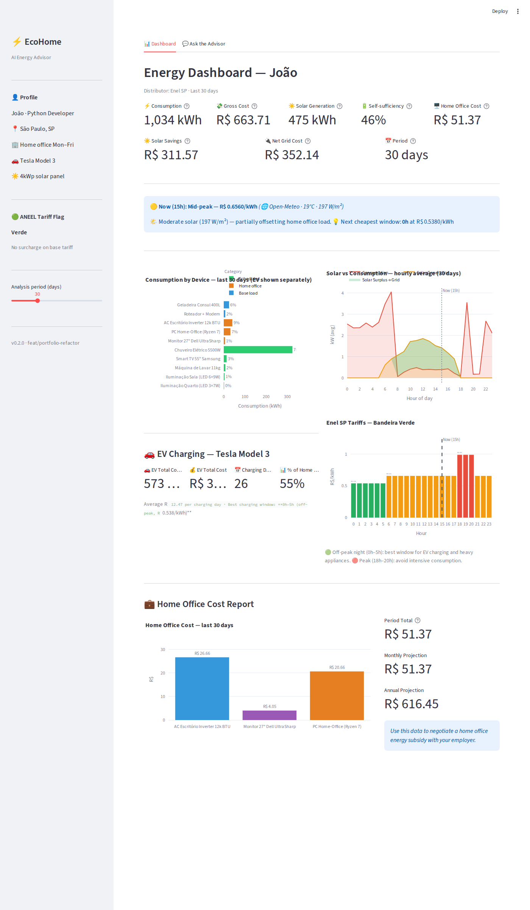
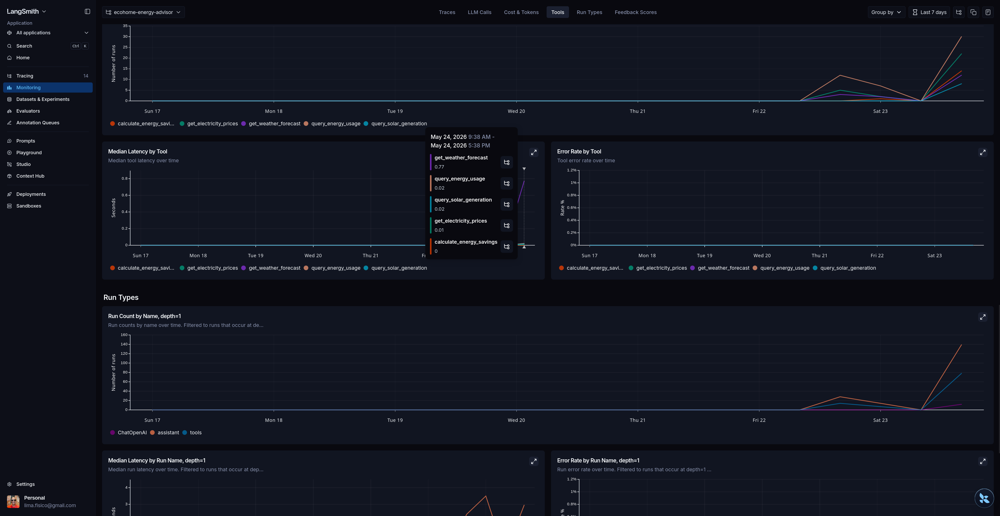

# EcoHome Energy Advisor


> AI-powered energy advisor for Brazilian households. Ask in natural language: *"Should I charge my Tesla now or wait for solar generation?"* The agent reasons over real consumption data, live weather, and ANEEL energy rates to give a grounded, quantified answer.



---

## Quick Start

```bash
git clone https://github.com/FabioCLima/Energy-Advisor-Project.git
cd Energy-Advisor-Project
echo "OPENAI_API_KEY=sk-..." > .env
docker compose up
```

Open **http://localhost:8501** — the container bootstraps João's demo dataset and local forecast artifacts on first run.

**Or pull the pre-built image directly:**

```bash
docker pull ghcr.io/fabiolima/energy-advisor-project:latest
docker run -e OPENAI_API_KEY=sk-... -p 8501:8501 ghcr.io/fabiolima/energy-advisor-project:latest
```

> No Docker? See [manual setup](#manual-setup) below.
> Cloud deploy notes: [Streamlit Cloud](deploy/streamlit/README.md) · [AWS App Runner](deploy/aws/README.md)

---

## Deployment Surfaces

This project is intentionally packaged for two complementary deployment surfaces:

| Surface | Purpose | Why it matters in interview |
|---|---|---|
| Streamlit Cloud | Public demo URL for the dashboard + chat | Shows product thinking and fast iteration |
| AWS App Runner | Production-style container deployment | Shows cloud, container, env-var, and bootstrap discipline |

The same codebase now provisions demo assets on first boot: SQLite tables, João sample data, and local forecasting artifacts. The container also supports **two runtime modes** through environment variables:
- `SERVICE_MODE=streamlit`
- `SERVICE_MODE=api`

That makes it easy to explain a clean progression from demo surface to cloud-native service without overcomplicating the architecture.

---

## Product & MLOps Assessment

This repository is a **deliberate product prototype** — scoped to demonstrate the essential building blocks of an AI/ML system without overengineering. The goal is to show the essential building blocks of an AI/ML product in the smallest credible scope: a usable dashboard, an API, a tool-using agent, model evaluation, observability, drift checks, guardrails, tests, Docker packaging and cloud deployment paths.

That framing matters for recruiters and interviewers: the project demonstrates that the same engineering discipline found in larger ML platforms can be applied deliberately at prototype scale.

| Capability | Standalone implementation in this repo | Production-scale evolution |
|---|---|---|
| Product surface | Streamlit dashboard + chat | Dedicated frontend, auth, user accounts |
| Agent service | FastAPI + LangGraph ReAct agent | Multi-tenant API, rate limits, service mesh |
| Model/agent evaluation | 18 scenarios in 4 categories (core, **adversarial**, multi-turn, RAG-gabarito) with ordered tool-trajectory + behavioral checks, optional LLM-as-judge, CI eval gate (`eval.yml`), reports versioned by prompt/contract hash + git commit | Larger benchmark sets, human review workflows |
| Observability | Local JSONL traces (both `invoke` and `stream` paths) with size-based rotation, plus a trace reader — `python -m energy_advisor.observability.report` aggregates cost/day, success rate, p95 latency, budget flags and top tools | LangSmith/OpenTelemetry traces, Prometheus/Grafana, CloudWatch alarms |
| Cost control | Real token counts from provider `usage_metadata` (covering every ReAct iteration), with labelled chars/4 heuristic fallback (`cost_source` field); budget enforcement with AUDIT/BLOCK rollout (`ENERGY_ADVISOR_BUDGET_MODE` — BLOCK interrupts the loop mid-run, API returns 429) | Model routing, cache policy, org-level cost dashboards |
| Drift monitoring | Baseline vs current window checks run as a **weekly scheduled process** (`drift.yml`: report artifact + warning annotation, never a build failure) and on demand via `python -m energy_advisor.services.drift_report` | Evidently/MLflow jobs, retraining triggers, model registry governance |
| Guardrails | Severity-tiered checks (low→critical): bilingual (EN + PT-BR) prompt-injection patterns, secret leakage, Brazilian PII/LGPD (CPF, CNPJ, phone, e-mail); contract **topicality enforcement** (`ENERGY_ADVISOR_SCOPE_MODE`: AUDIT flags out-of-scope questions, BLOCK redirects without spending tokens); output validation applied to **both** `invoke` and token streaming | Classifier/moderation-based detection, policy engine, red-team suites |
| Deployment | Docker, Streamlit Cloud path, AWS App Runner path | IaC, blue/green deploys, autoscaling, secrets manager, VPC controls |

### How MLE and AI Engineer converge here

This project sits deliberately at the intersection of both roles:

- **MLE angle:** forecasting model, validation metrics, drift monitoring, model artifacts, evaluation harness and deployment discipline.
- **AI Engineer angle:** LangGraph agent, tool calling, RAG-style retrieval, prompt/system design, LLM observability, guardrails and cost/latency control.

The story here is deliberate: **an AI product prototype with MLE-grade evaluation and production-oriented controls.**

### Observability with LangSmith

LangSmith is used for production debugging and evaluation review — the agent supports LangChain/LangGraph tracing environment variables, and when enabled, the evaluation harness captures traces automatically. The hosted UI is https://smith.langchain.com and the default API endpoint is https://api.smith.langchain.com. To measure agent behavior in LangSmith, set:

```bash
export LANGCHAIN_TRACING_V2=true
export LANGCHAIN_API_KEY=ls__...
export LANGCHAIN_PROJECT=ecohome-energy-advisor
```

Then run either the API or evaluation harness. In LangSmith, inspect:

- tool-call sequence per request
- LLM latency and token usage
- failed runs and exceptions
- prompt, model and response versions
- scenario traces from the evaluation harness
- regressions when changing prompts, tools or models

The advantage is practical: local JSONL traces prove the concept and work anywhere; LangSmith gives a visual trace UI for debugging, demos and team review.

### Agent Observability

The LangGraph agent is traced in LangSmith, making tool usage, latency, error rate and run types inspectable during evaluation and debugging.

This screenshot shows tool-level observability for the EcoHome agent: which tools were called, how often, their median latency, and whether any tool errors occurred.



For implementation rationale, see [`docs/mlops_implementation_notes.md`](docs/mlops_implementation_notes.md).


---

## Run the API (FastAPI native)

```bash
uv run uvicorn energy_advisor.api.app:app --reload --port 8000
```

Open:
- **http://localhost:8000/docs** (OpenAPI / Swagger UI)
- **http://localhost:8000/health** (health check)

The native FastAPI endpoints are exposed under `POST /advisor/invoke` and `POST /advisor/stream`. There is no LangServe playground route in the current architecture.

Service-boundary controls (all opt-in via env vars, demo-permissive by default):

| Control | Env var | Behaviour |
|---|---|---|
| Auth | `ENERGY_ADVISOR_API_AUTH_KEY` | When set, `/advisor/*` requires a matching `X-API-Key` header (401 otherwise) |
| Rate limit | `ENERGY_ADVISOR_RATE_LIMIT_PER_MINUTE` | In-memory sliding window per client IP (429); per instance — multi-replica needs Redis |
| CORS | `ENERGY_ADVISOR_CORS_ORIGINS` | Comma-separated allowed origins (default `*` for demo) |
| Budget | `ENERGY_ADVISOR_BUDGET_MODE=block` | Mid-run cost budget enforcement → 429 |
| Error hygiene | — | 500 responses carry only a `request_id` reference; the real exception goes to the log, correlated with the agent trace |

---

## The Problem

Brazilian households with solar panels, EVs, and home offices face three disconnected data sources:
- **Energy bills** (kWh and BRL, with ANEEL bandeira surcharges that change monthly)
- **Solar generation** (depends on irradiance — weather changes everything)
- **Usage patterns** (EV charges at night, home office runs 9–18h, AC peaks in summer)

Manually cross-referencing these to answer "what's the cheapest time to charge my car today?" is impossible without tooling. EcoHome automates that reasoning.

---

## What the Agent Does

The LangGraph ReAct agent coordinates **9 specialized tools** and reasons over multiple sources before responding:

| Tool | Data source | What it enables |
|---|---|---|
| `query_energy_usage` | SQLite (90 days, per-device) | "How much did my AC cost last week?" |
| `query_solar_generation` | SQLite (hourly generation) | "When did my panel produce the most?" |
| `get_electricity_prices` | ANEEL TOU + bandeira table | "What's the current energy rate?" |
| `get_weather_forecast` | **Open-Meteo API** (real data) | "Will solar generate enough this afternoon?" |
| `search_energy_tips` | ChromaDB RAG (5 documents) | "Best practices for EV charging?" |
| `calculate_energy_savings` | Savings math engine | "How much would I save shifting to off-peak?" |
| `get_recent_energy_summary` | SQLite aggregate | "What's been my recent energy usage?" |
| `predict_energy_usage` | SQLite + baseline/ML model artifact | "What will my usage look like tomorrow?" |
| `optimize_energy_schedule` | Forecast router + pricing + heuristics | "What should I shift to save over the next 30 days?" |

**Example exchange:**

> **User:** Vale a pena ligar o ar-condicionado agora?
>
> **Agent:** Agora (15h) você está em horário mid-peak (R$ 0,6560/kWh) com irradiância solar moderada de 197 W/m² — seu painel está gerando parcialmente. O custo real do AC é de ~R$ 0,35/h com o offset solar. Se esperar até as 18h, o pico sobe para R$ 0,987/kWh. **Recomendação: ligue agora, antes do horário de ponta.**

---

## Architecture


Six-layer design — each layer testable and replaceable independently:

| Layer | Component | Role |
|---|---|---|
| 1. Interaction | Streamlit | Dashboard + streaming chat |
| 2. Orchestration | LangGraph ReAct | Reason → Act → Observe loop |
| 3. Tools | 9 `@tool` functions | Isolated, typed, directly testable |
| 4. Services | Business logic | database · pricing · forecasting · retrieval |
| 5. Storage | SQLite + ChromaDB | Time-series + vector embeddings |
| 6. Observability | Loguru + LangSmith | Structured logs + optional trace UI |

The agent operates on a shared `AgentState` object that flows through the LangGraph graph. Its schema is deliberately minimal: `messages` (the full conversation thread, including tool calls and tool responses embedded in the message history). Each node reads from and writes to this state — making the graph's behavior fully inspectable at every step. The ReAct loop runs under an explicit iteration cap (`ENERGY_ADVISOR_MAX_AGENT_ITERATIONS`): when exceeded, the user receives an honest "couldn't finish" answer and the trace records `error=recursion_limit` instead of surfacing a stack trace.

**Key decisions:**

- **LangGraph over LCEL** — the ReAct loop (reason → call tool → reason again) is not linear. LangGraph represents it as an explicit state machine: each node is independently testable; each transition is auditable. When the agent fails, you see exactly which node, with which state.
- **SQLite over PostgreSQL** — portability for demo. `DatabaseManager` uses SQLAlchemy; swap the connection string to migrate to PostgreSQL with no application code changes.
- **Open-Meteo over synthetic weather** — free, no API key, provides `direct_radiation + diffuse_radiation` (W/m²) — the exact inputs needed for photovoltaic generation estimation. Falls back to deterministic synthetic data if unreachable.
- **ANEEL energy rate provenance** — rate flags and distributor pricing are resolved through a provenance-aware service: in-memory cache → disk cache → external fetch (when enabled) → bundled fallback. The dashboard surfaces `source`, `fetched_at`, and `fallback_used` for full transparency.
- **Aggregated tool output** — `query_energy_usage` returns per-device totals (~15 rows), not raw records (~2,000 rows). Sending raw records to an LLM produces hallucinated answers. The aggregation happens inside the tool, not in the prompt.
- **No prices in the prompt** — the system prompt names the tariff windows but never quotes R$/kWh values; the model must call `get_electricity_prices`. A prompt that both forbids fabricating prices and contains prices is a contradiction that diverges silently (guarded by `tests/test_prompts.py`).
- **Conversation memory via checkpointer** — requests carrying a `session_id` reuse a LangGraph thread (`MemorySaver`), so follow-ups keep context; requests without one stay single-turn. Per-process memory; the documented evolution is a persistent checkpointer (SqliteSaver/PostgresSaver).

---

## Persona: João

João is the **default `UserProfile`** (`energy_advisor/profile.py`), rendered into the system prompt by `render_instructions()` — supporting another household means defining another profile, not rewriting the prompt. All sample data is generated for a realistic Brazilian household:

| Attribute | Value |
|---|---|
| Name | João — Python Developer |
| Location | São Paulo, SP |
| Work | Home office Mon–Fri |
| Solar | 4kWp panel (10 × 400W modules) |
| EV | Tesla Model 3 Long Range |
| Distributor | Enel SP |
| Data | 90 days · 6,631 usage records · 1,081 solar records |

Device profiles use `prob_fn: Callable[[datetime], float]` encoding domain knowledge: the Tesla charges stochastically on Tue/Thu/Sun nights (0h–5h, off-peak); the AC has 85% usage probability in January (SP summer) and 20% in May; solar follows a Gaussian curve peaking at noon scaled by monthly irradiance.

---

## Evaluation

The agent is evaluated across **18 scenarios in four categories** — because evaluating an agent is mostly evaluating how it fails, not just how it succeeds:

| Category | Scenarios | What it proves |
|---|---|---|
| `core` | 11 | Grounded answers on the happy path |
| `adversarial` | 3 | Out-of-scope flagged by the contract (no LLM call), PT-BR prompt injection blocked, and **honesty under tool failure** (empty DB → the answer must state the limitation, not fabricate numbers) |
| `multi_turn` | 2 | Follow-ups keep context through the session thread ("e no fim de semana?") |
| `rag` | 2 | Citations match a per-question gabarito (expected source file) and never reference files outside the corpus |

**Trajectory evaluation** — each scenario defines the tools the agent must call, checked in two dimensions reported separately: **membership** (every required tool was called) and **order** (required tools appear as an ordered subsequence of the actual calls, allowing interleaving). Scenarios where the grounding tools are independent declare `order_matters=False`. Behavioral expectations (guardrail blocks, limitation statements, citation gabarito) are reported as `behavior_pass`; a scenario passes only when both hold.

**LLM-as-judge** — a separate LLM scores the final response on four criteria with rubric:
1. **Grounding** — numbers in the response are traceable to tool output
2. **Completeness** — recommendation + rationale + estimate + limitations
3. **Actionability** — the recommendation is concrete and executable
4. **Honesty** — assumptions are explicit when data is incomplete

Latest local run on **May 24, 2026**:

| Mode | Result | Notes |
|---|---|---|
| Trajectory only | `12/12` scenarios passed | `0` execution errors, `8.93s` avg/scenario |
| LLM-as-judge | `4.31 / 5.00` overall | Grounding `4.33`, Completeness `4.42`, Actionability `4.00`, Honesty `4.50` |

Lowest-scoring scenarios from the judged run:
- `current_tariff_period` (`3.5/5`) — answer needs clearer source/limitations language.
- `recent_summary_24h` (`3.25/5`) — grounded but not actionable enough.
- `predict_usage_tomorrow` (`3.25/5`) — forecast is detailed, but recommendation/method explanation can be stronger.

Run the evaluation pipeline:

```bash
python -m energy_advisor.evaluation.runner
# Output: eval_report_YYYYMMDD_HHMMSS.json (timestamped by default)
# Summary appended to data/observability/eval_history.jsonl after each run
# --output path/to/report.json  override the output path
# --quick                       run 4 scenarios instead of all 12
# --no-judge                    skip LLM scoring (trajectory only)
```

Every report carries a `versions` block — SHA-256 hashes of the system prompt and `AgentContract`, plus the git commit — so two entries in `eval_history.jsonl` are only compared when they ran the same prompt. A sample report lives in [`docs/examples/eval_report_sample.json`](docs/examples/eval_report_sample.json).

**CI gate** — `.github/workflows/eval.yml` runs the quick trajectory suite (no judge) on PRs labelled `eval`, weekly, or on demand, and fails the build when `trajectory_pass_rate < 1.0` or any scenario errors. The full report is uploaded as a build artifact.

---

## ML Model

The forecasting layer uses `HistGradientBoostingRegressor` over lagged hourly usage, rolling means, and cyclical hour / day-of-week features. Training runs on roughly 90 days of hourly history per device family and saves a `.joblib` artifact with the fitted estimator, training window metadata, and hold-out validation metrics.

Latest local hold-out evaluation (last 7 days) shows why the dashboard now exposes model quality instead of assuming the ML path is always better:

| Forecast target | Model RMSE | Baseline RMSE | Model MAE | Baseline MAE | Takeaway |
|---|---|---|---|---|---|
| `all` | `0.8047` | `0.8420` | `0.4678` | `0.4322` | Better RMSE, worse MAE |
| `ev` | `0.4615` | `0.3458` | `0.1497` | `0.1170` | Baseline still wins |

Known limitation: the model forecasts recursively, so error accumulates with longer horizons. Because of that, the Streamlit forecast section shows both the selected method and its saved validation metrics before presenting the curve.

---

## Documentation & Learning

| Document | What it is |
|---|---|
| [`docs/adr/`](docs/adr/README.md) | Architecture Decision Records — one page per structural decision, with the cost of each |
| [`docs/LEARNING_PATH.md`](docs/LEARNING_PATH.md) | Module → AI-engineering concept → interview question mapping, for juniors studying this repo |
| [`docs/EXERCISES.md`](docs/EXERCISES.md) | 8 guided exercises (good-first-issue format) extending the project for real |
| [`docs/BACKLOG_MVP_AUDITAVEL.md`](docs/BACKLOG_MVP_AUDITAVEL.md) | The senior-review backlog that drove the integrity/auditability phase |

---

## Tech Stack

| Layer | Technology |
|---|---|
| Agent framework | LangGraph 0.2 · LangChain 0.3 |
| LLM | OpenAI GPT-4o-mini (default) · GPT-4o (quality mode) |
| Weather | Open-Meteo API (free, no key required) |
| Database | SQLite + SQLAlchemy ORM |
| Vector store | ChromaDB (local, no external infra) |
| Validation | Pydantic v2 + Pydantic-settings |
| Dashboard | Streamlit + Plotly |
| Logging | Loguru (structured) + LangSmith (optional tracing) |
| Container | Docker + Docker Compose · single image with `streamlit` / `api` runtime modes |
| Tests | pytest · 253 tests · 81% coverage (incl. agent graph tests with injected fake model — no API key needed) |
| Linting | Ruff |

---

## Project Structure

```
Energy-Advisor-Project/
├── app/
│   ├── streamlit_app.py          ← UI entrypoint
│   └── components/
│       ├── charts.py             ← Plotly chart functions
│       └── chat.py               ← Chat tab + agent calls
├── energy_advisor/
│   ├── agent.py                  ← LangGraph ReAct graph
│   ├── config.py                 ← Pydantic-settings (env vars + guardrail mode)
│   ├── contract.py               ← AgentContract (scope, topics, enforcement policy)
│   ├── guardrails.py             ← Severity tiering, PII/LGPD, AUDIT/BLOCK mode
│   ├── observability.py          ← AgentTrace (session_id, tool call args, costs)
│   ├── schemas.py                ← Pydantic v2 I/O schemas
│   ├── profile.py                ← UserProfile (João is the default, swappable)
│   ├── prompts.py                ← System prompt template rendered from UserProfile
│   ├── tools/                    ← 9 @tool decorated functions
│   ├── evaluation/               ← Scenario harness, LLM-as-judge, eval_history
│   └── services/
│       ├── database.py           ← SQLAlchemy models + DB manager
│       ├── aneel_client.py       ← Provenance-aware ANEEL cache/fallback client
│       ├── forecasting.py        ← Open-Meteo + synthetic fallback
│       ├── forecast_router.py    ← Shared baseline/ML routing
│       ├── optimizer.py          ← Heuristic schedule optimization
│       ├── pricing.py            ← Energy rates + ANEEL provenance contract
│       ├── recommendations.py    ← Savings calculation engine
│       ├── retrieval.py          ← ChromaDB RAG pipeline
│       └── usage_forecasting_ml.py ← HistGradientBoostingRegressor + evaluation
├── tests/                        ← 253 unit tests (81% coverage)
├── data/
│   ├── documents/                ← RAG knowledge base (5 docs)
│   ├── energy_data.db            ← SQLite (generated on first run)
│   └── vectorstore/              ← ChromaDB index (generated)
├── migrations/                   ← Alembic schema migrations (baseline)
├── Dockerfile
├── docker-compose.yml
├── docker-entrypoint.sh
└── deploy/
    ├── aws/                  ← App Runner notes + env example
    └── streamlit/            ← Streamlit Cloud notes
```

---

## Manual Setup

```bash
# Install deps (uv recommended)
uv venv --python 3.12 && source .venv/bin/activate
uv pip install -r requirements.txt

# Configure
cp .env.example .env
# Edit .env and set OPENAI_API_KEY=sk-...

# Bootstrap data (first run only)
python -m energy_advisor.bootstrap.db_setup
python -m energy_advisor.bootstrap.sample_data
python -m energy_advisor.bootstrap.ml_train
# Optional: requires embedding credentials
python -m energy_advisor.bootstrap.rag_setup

# Run dashboard
python -m streamlit run streamlit_app.py

# Run tests
pytest tests/ -v
```

---

## Dashboard Charts

| Chart | What it shows |
|---|---|
| Consumption by Device | Per-device kWh + % of total; EV shown separately (D1 fix) |
| Solar vs Consumption | Hourly average kW; green area = surplus exported to grid |
| Enel SP Energy Rates | TOU rates by hour; vertical line = current time |
| Home Office Cost | PC + Monitor + AC office; monthly and annual projections |

The "Insight of the Day" card (top of dashboard) combines the current energy rate period, real-time irradiance from Open-Meteo, and the cheapest upcoming window — all pre-computed, no agent call required.
