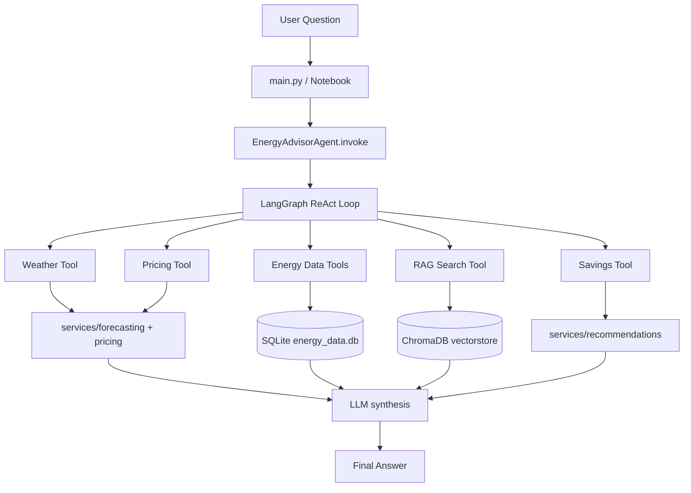
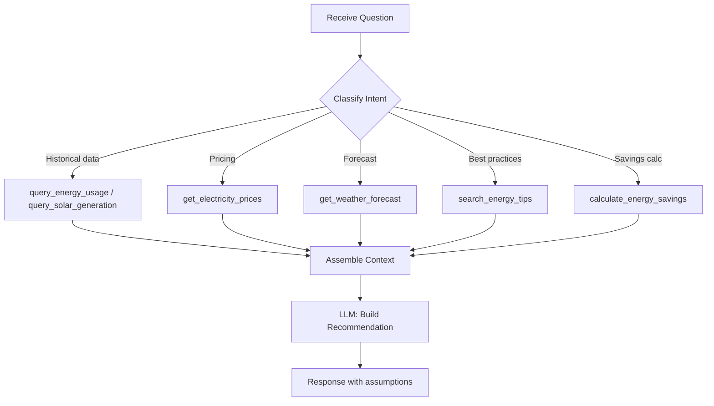
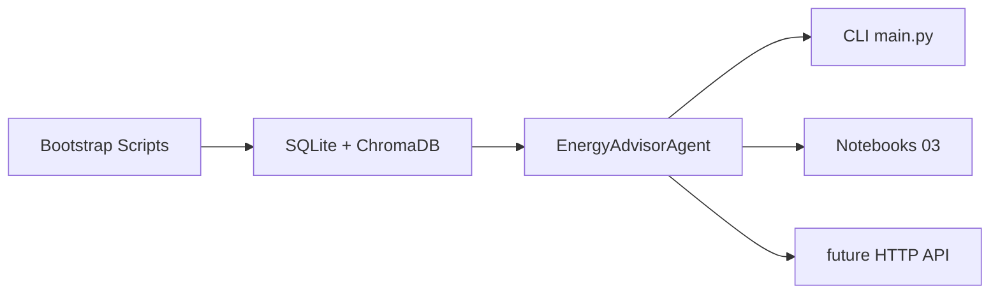

# Architecture

The system is organized into **six layers**. Each layer has a single responsibility and communicates only with the layers adjacent to it.

## Layer Stack

```
User Question
     │
     ▼
┌─────────────────────────────┐
│  Interaction Layer          │  CLI / Notebook / future API
├─────────────────────────────┤
│  Agent Orchestration        │  LangGraph ReAct (agent.py)
├─────────────────────────────┤
│  Tooling Layer              │  tools/ — thin, validated wrappers
├─────────────────────────────┤
│  Service Layer              │  services/ — pure business logic
├─────────────────────────────┤
│  Storage Layer              │  SQLite + ChromaDB
└─────────────────────────────┘
              │
              ▼
     Observability Layer
     (Loguru + LangSmith)
```

## End-to-End Runtime Flow



## Internal Decision Flow



## Development vs Production Flow



## Key Design Principles

| Principle | How it's applied |
|---|---|
| Separation of concerns | Tools call services; services own logic; agent orchestrates |
| Validate at boundaries | Pydantic on every tool input and output |
| Injection over globals | `DatabaseManager(db_path)` from `Settings`, not hardcoded |
| Idempotent bootstrap | DB setup and RAG indexing are safe to re-run |
| No logic in notebooks | Notebooks import package code; cells contain no business rules |

## Related Notes

- [[02_Config_and_Settings]] — where settings flow into layers
- [[03_Agent_and_Prompts]] — how the agent orchestration layer works
- [[04_Tools]] — the tooling layer in detail
- [[05_Services]] — the service layer in detail
