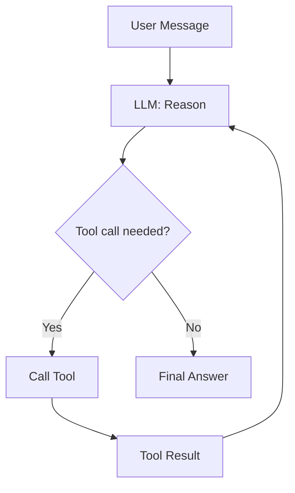

# Agent and Prompts

The agent is the orchestration layer. It receives a user question, decides which tools to call, calls them in order, and synthesizes the results into a final answer.

## How LangGraph ReAct Works

The agent uses the **ReAct** (Reason + Act) pattern implemented by LangGraph's `create_react_agent`.



**Each iteration:**
1. The LLM reads the full message history (question + all previous tool results)
2. Decides whether to call a tool or answer directly
3. If calling a tool: produces a structured `tool_call` message
4. LangGraph executes the tool and appends the result
5. Loop repeats until the LLM produces a final answer (no tool call)

## EnergyAdvisorAgent Class

**File:** `energy_advisor/agent.py`

```python
agent = EnergyAdvisorAgent()
result = agent.invoke("When should I charge my EV?")
answer = result["messages"][-1].content
```

### Constructor Parameters

| Parameter | Default | Purpose |
|---|---|---|
| `instructions` | `SYSTEM_INSTRUCTIONS` | System prompt text |
| `settings` | `Settings()` | Config override (useful for testing) |
| `model` | from `Settings` | LLM model name override |

### What the constructor does

1. Loads `.env` file from repo root or `ecohome_solution/`
2. Validates `Settings` (fails fast if API key missing)
3. Configures Loguru logging
4. Sets LangSmith env vars for tracing
5. Creates `ChatOpenAI` with the selected model
6. Calls `create_react_agent(model, tools=TOOL_KIT, prompt=SystemMessage(...))`

## System Prompt Design

**File:** `energy_advisor/prompts.py`

The system prompt establishes four behavioral rules:

```
1. Prefer tool usage over assumptions. If data is needed, call tools.
2. Do not fabricate prices, forecasts, or historical usage.
3. State limitations clearly when a tool fails or data is missing.
4. Label savings estimates clearly and state key assumptions.
```

And a fixed **response structure**:
```
1) Recommendation (actionable)
2) Why (data-based rationale)
3) Estimated savings/impact (if possible)
4) Supporting tips (from knowledge base)
5) Assumptions & limitations
```

## Guardrails

The prompt enforces three behavioral guardrails:

| Guardrail | Effect |
|---|---|
| Tool-first | LLM calls tools before answering; avoids hallucination |
| Honest uncertainty | Explicitly states when data is incomplete |
| Estimate labeling | Savings marked as estimates, not facts |

## Tool Registration

Tools are registered as a list called `TOOL_KIT` in `energy_advisor/tools/__init__.py`:

```python
TOOL_KIT = [
    get_weather_forecast,
    get_electricity_prices,
    query_energy_usage,
    query_solar_generation,
    get_recent_energy_summary,
    search_energy_tips,
    calculate_energy_savings,
]
```

Each function decorated with `@tool` becomes a LangChain tool. The agent selects tools based on their **docstring** — the docstring is literally what the LLM reads to decide which tool to call.

## Related Notes

- [[04_Tools]] — the tools the agent can call
- [[01_Architecture]] — where the agent sits in the system
- [[02_Config_and_Settings]] — how model and API key are configured
