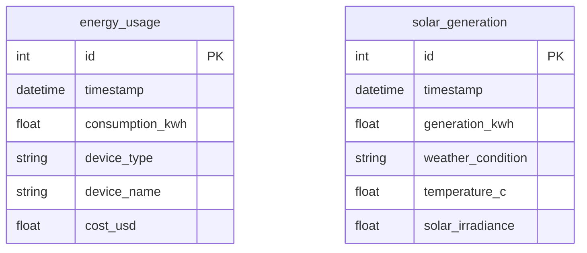

# Data Layer

The data layer stores historical energy consumption and solar generation in a local **SQLite** database using **SQLAlchemy** ORM.

## Why SQLite?

- Zero-configuration: no server, no credentials
- File-based: easy to move, copy, or reset
- SQLAlchemy ORM: same code works with PostgreSQL if you ever need it
- Sufficient for household data volumes (millions of rows per year)

## Schema



Both tables are indexed on `timestamp` for fast date-range queries.

## Models

**File:** `energy_advisor/services/database.py`

```python
class EnergyUsage(Base):
    __tablename__ = "energy_usage"
    # Tracks hourly consumption per device
    device_type: EV | HVAC | appliance | lighting
    device_name: "Tesla Model 3", "Main AC", etc.
    cost_usd: cost at time of consumption

class SolarGeneration(Base):
    __tablename__ = "solar_generation"
    # Tracks hourly solar output
    weather_condition: sunny | partly_cloudy | cloudy
    solar_irradiance: W/m² (correlates with generation)
```

## DatabaseManager

`DatabaseManager` is a session-safe wrapper. It creates a new session per operation and closes it in a `finally` block — this avoids connection leaks.

```python
db = DatabaseManager(db_path="data/energy_data.db")
db.create_tables()

# Write
db.add_usage_record(timestamp=..., consumption_kwh=2.5, device_type="EV")

# Read
records = db.get_usage_by_date_range(start_dt, end_dt)
recent = db.get_recent_usage(hours=24)
```

## Lazy Initialization in Tools

The `energy_data.py` tool uses `functools.lru_cache` to avoid creating a new `DatabaseManager` on every tool call:

```python
@functools.lru_cache(maxsize=1)
def _get_db(db_path: str) -> DatabaseManager:
    return DatabaseManager(db_path=db_path)

def _db() -> DatabaseManager:
    return _get_db(Settings().db_path)
```

This is called **lazy initialization**: the database connection is created on the first call, then reused for all subsequent calls.

## Sample Data Profiles

The bootstrap generates 30 days of synthetic data with these device profiles:

| Device | Type | Active Hours | kWh Range |
|---|---|---|---|
| Tesla Model 3 | EV | 22:00–06:00 | 1.5–7.2 |
| Main AC | HVAC | 09:00–22:00 | 0.8–2.5 |
| Washing Machine | appliance | 09:00, 14:00 | 0.5–1.2 |
| Dishwasher | appliance | 20:00–22:00 | 0.3–0.9 |
| Water Heater | appliance | 06:00–07:00, 18:00–19:00 | 1.0–2.0 |
| LED Lighting | lighting | 18:00–07:00 | 0.05–0.2 |

Solar records use a 5 kW panel system with irradiance based on time of day and randomly selected weather condition.

## Date Range Queries

> **Important:** The `get_usage_by_date_range(start, end)` method uses `<=` for the end date. This means `end = datetime(2025, 3, 4)` is midnight of March 4, **not** end-of-day. To include all records on March 4, pass `datetime(2025, 3, 4, 23, 59, 59)` or `datetime(2025, 3, 5)`.
>
> The `query_energy_usage` **tool** automatically adds `timedelta(days=1)` to the end date, so passing `"2025-03-04"` to the tool correctly includes all records on that day.

## Related Notes

- [[05_Services]] — DatabaseManager service context
- [[08_Bootstrap]] — how sample data is generated
- [[09_Testing]] — how test fixtures use temporary databases
