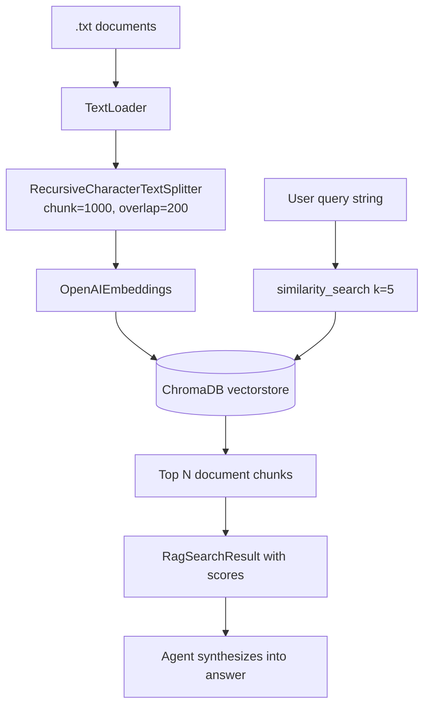

# RAG Pipeline

RAG (Retrieval-Augmented Generation) grounds the agent's recommendations in curated knowledge documents rather than relying purely on LLM parametric knowledge.

## How It Works



## Ingestion (Bootstrap)

**File:** `energy_advisor/bootstrap/rag_setup.py`

1. Reads all `.txt` files from `settings.documents_dir`
2. Loads each file with `TextLoader`
3. Splits into chunks (1000 chars, 200 overlap)
4. Embeds with `OpenAIEmbeddings`
5. Persists to `settings.vectorstore_dir` as ChromaDB

**Idempotent:** If `chroma.sqlite3` already exists, skips re-ingestion.

## Knowledge Base Documents

| File | Content |
|---|---|
| `tip_energy_savings.txt` | General home energy efficiency tips |
| `tip_device_best_practices.txt` | Device scheduling, EV/HVAC/dishwasher |
| `tip_solar_optimization.txt` | Solar self-consumption, batteries, net metering |
| `tip_ev_charging.txt` | EV TOU scheduling, V2H, Level 1 vs 2 |
| `tip_cost_reduction.txt` | TOU strategies, demand charges, ROI calculations |

## Retrieval (Tool)

**File:** `energy_advisor/tools/rag.py`

```python
result = search_energy_tips.invoke({
    "query": "best time to charge EV",
    "max_results": 5
})
# Returns: {"query": ..., "total_results": 3, "tips": [...]}
```

Each tip includes:
- `rank` — position in results (1 = most relevant)
- `content` — the retrieved text chunk
- `source` — source filename
- `relevance_score` — `high` (rank 1–2), `medium` (3–4), `low` (5+)

## Chunk Size Tradeoffs

| Setting | Effect |
|---|---|
| Smaller chunks (500) | More precise retrieval, less context per chunk |
| Larger chunks (1500) | More context, but may retrieve irrelevant text |
| Overlap (200) | Prevents splitting a tip at a sentence boundary |

The current defaults (1000/200) are a good starting point for short tip documents.

## Embedding Model

Uses `OpenAIEmbeddings` (default: `text-embedding-ada-002`). The embedding model is separate from the chat model — you need your `OPENAI_API_KEY` for both.

## Extending the Knowledge Base

To add new documents:
1. Add a `.txt` file to `ecohome_solution/data/documents/`
2. Delete `ecohome_solution/data/vectorstore/` (or just `chroma.sqlite3`)
3. Re-run: `python -m energy_advisor.bootstrap.rag_setup`

The `list_document_paths` helper automatically discovers all `.txt` files in the directory.

## Related Notes

- [[04_Tools]] — the `search_energy_tips` tool
- [[05_Services]] — the `retrieval.py` service
- [[08_Bootstrap]] — the full bootstrap process
