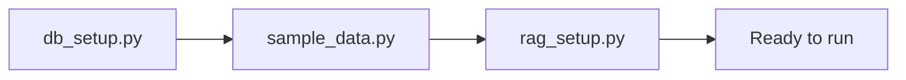

# Bootstrap

Bootstrap is the **one-time initialization process** that prepares the system to run. It is distinct from the application runtime.

## Why a Separate Bootstrap?

Notebooks are great for exploration but cannot be used in CI/CD, deployment scripts, or scheduled jobs. Bootstrap modules are Python scripts that can be run from the terminal, imported by tests, or called from automation pipelines.

## Three Steps



### Step 1: `db_setup.py`

```bash
python -m energy_advisor.bootstrap.db_setup
```

- Creates `data/energy_data.db`
- Creates `energy_usage` and `solar_generation` tables
- **Idempotent:** SQLAlchemy's `create_all` skips existing tables

---

### Step 2: `sample_data.py`

```bash
python -m energy_advisor.bootstrap.sample_data
```

- Checks `count_usage_records() > 0` — skips if data already present
- Generates 30 days of hourly records for 6 device profiles
- Uses a fixed random seed (`seed=42`) for reproducibility
- Applies TOU pricing: off-peak=0.09, mid-peak=0.13, peak=0.21
- Generates solar records with irradiance bell curve

**Idempotent:** Will not add duplicate data if run twice.

---

### Step 3: `rag_setup.py`

```bash
python -m energy_advisor.bootstrap.rag_setup
```

- Reads all `.txt` files from `settings.documents_dir`
- Chunks and embeds them into ChromaDB
- **Requires API key** (OpenAI embeddings)
- **Idempotent:** Skips if `chroma.sqlite3` already exists

---

## Full Bootstrap Sequence

```bash
cd ecohome_solution
python -m energy_advisor.bootstrap.db_setup
python -m energy_advisor.bootstrap.sample_data
python -m energy_advisor.bootstrap.rag_setup
python main.py "When should I charge my EV?"
```

## Calling from Python (e.g., in tests or notebooks)

```python
from energy_advisor.config import Settings
from energy_advisor.bootstrap.db_setup import setup_database
from energy_advisor.bootstrap.sample_data import load_sample_data
from energy_advisor.bootstrap.rag_setup import setup_vectorstore

settings = Settings()
setup_database(settings)
load_sample_data(settings, days=7)   # shorter window for testing
setup_vectorstore(settings)
```

## Resetting the System

```bash
# Delete database (will be recreated on next db_setup run)
rm ecohome_solution/data/energy_data.db

# Delete vectorstore (will be rebuilt on next rag_setup run)
rm -rf ecohome_solution/data/vectorstore/
```

## Related Notes

- [[06_Data_Layer]] — what the database contains
- [[07_RAG_Pipeline]] — what the vectorstore contains
- [[02_Config_and_Settings]] — how paths are configured
