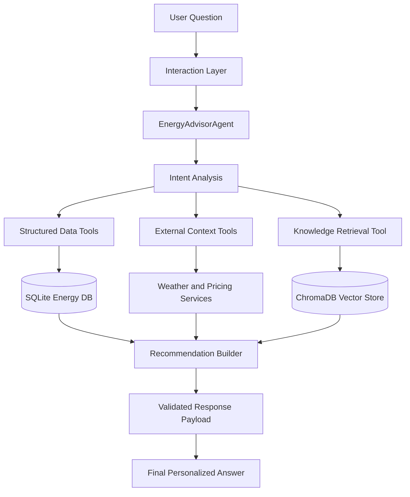
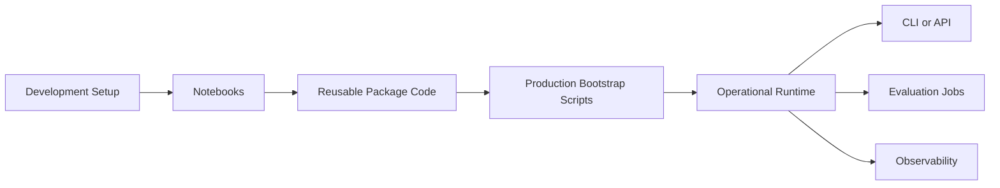
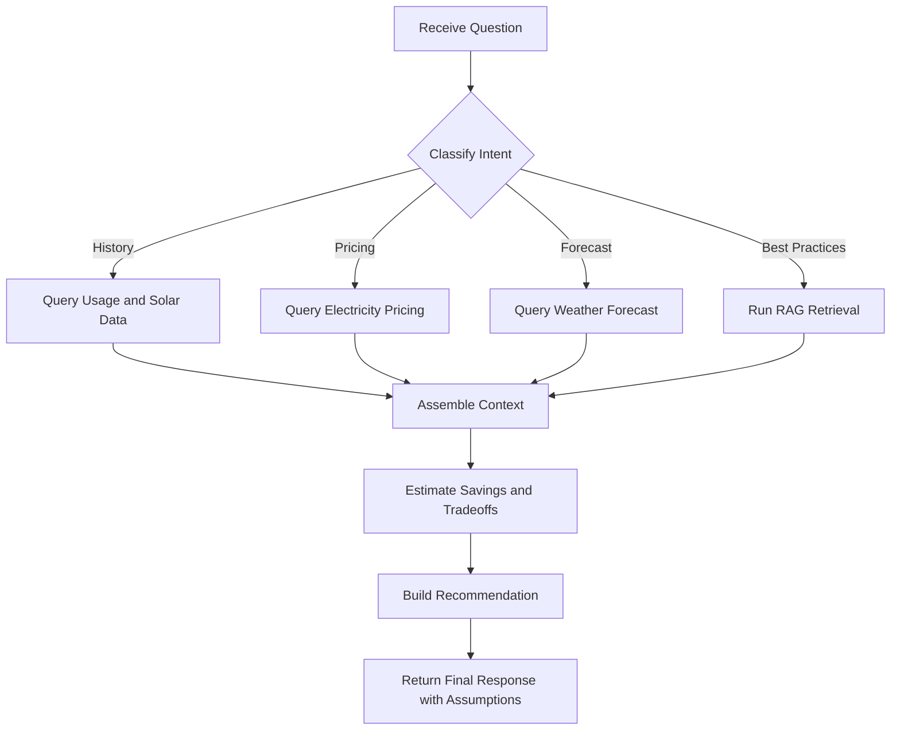

# EcoHome Energy Advisor

## Purpose

This document is the single source of truth for the **EcoHome Energy Advisor** project.

It defines:

- the product problem
- the solution goals
- the target architecture
- the development and production operating model
- the implementation phases
- the engineering standards and guardrails

This file should evolve during development and remain the main reference for technical and product decisions.

---

## 1. Problem Context

EcoHome is building an AI-powered Energy Advisor for smart homes. The goal is to help users reduce electricity costs, increase solar self-consumption, and improve the efficiency of connected devices such as EV chargers, HVAC systems, appliances, and other smart-home equipment.

The system should answer questions such as:

- When should I charge my electric car to minimize cost and maximize solar power?
- How can I better use solar generation throughout the day?
- Which devices should run during off-peak windows?
- How much money can I save by changing my routine?
- What actions should I take based on my historical energy usage?

The solution must not behave like a generic chatbot. It should act as a **data-grounded energy advisor** that uses tools, validates inputs, and generates explainable recommendations.

---

## 2. Solution Goal

Build an intelligent agent that can:

- analyze energy consumption patterns and solar generation trends
- recommend optimal times to run household devices
- incorporate weather forecasts and dynamic electricity pricing into decisions
- retrieve supporting guidance from an energy-efficiency knowledge base
- estimate savings, tradeoffs, and environmental impact

The final deliverable should be implemented under `ecohome_solution/`.

---

## 3. Core Capabilities

The system is expected to support the following capabilities:

- **Multi-tool reasoning**
  - weather forecasts
  - electricity prices
  - energy usage queries
  - solar generation queries
- **Historical analysis**
  - review past household behavior to personalize recommendations
- **RAG-based knowledge retrieval**
  - retrieve best practices and energy-saving guidance from curated documents
- **Cost optimization**
  - use pricing windows, forecasted solar production, and device flexibility
- **Savings estimation**
  - quantify cost reduction, efficiency gains, and possible ROI

---

## 4. Inputs and Outputs

### Inputs

- energy usage data
- solar generation data
- weather forecasts
- electricity pricing data
- knowledge base documents
- natural-language user questions

### Expected outputs

Each response should aim to include:

- a primary recommendation
- a concise explanation grounded in data
- an estimated savings or impact statement when applicable
- supporting best-practice guidance when relevant
- explicit assumptions or limitations when data is incomplete

---

## 5. Architecture Principles

The project should follow these principles:

### 5.1 Separation of concerns

- agent orchestration should not contain raw data-access logic
- tools should stay thin and delegate logic to services
- business rules should live in services
- schemas should define contracts between layers
- environment configuration should live in config

### 5.2 Notebook-first for learning, script-first for production

Notebooks are useful for:

- local exploration
- demos
- debugging
- manual evaluation

But production setup and recurring operations must run through reusable Python modules and scriptable entrypoints.

### 5.3 Validation at boundaries

Use Pydantic to validate:

- environment variables
- tool inputs
- tool outputs
- recommendation payloads

### 5.4 Observability by default

Use Loguru for structured application logging and optionally LangSmith for tracing agent execution.

### 5.5 Production-aware design

Even if the first release is local, the architecture should anticipate:

- future HTTP API exposure
- external data providers
- scheduled refresh jobs
- stronger evaluation and monitoring

---

## 6. Target Architecture

The system should be organized into six layers.

### 6.1 Interaction Layer

Responsible for receiving user requests and returning responses.

Examples:

- notebooks
- local CLI
- future HTTP API

Responsibilities:

- accept natural-language queries
- pass inputs to the agent package
- display readable final answers

### 6.2 Agent Orchestration Layer

Implemented with LangGraph.

Responsibilities:

- identify user intent
- determine which tools are required
- coordinate sequential or conditional tool calls
- combine structured results and RAG results
- produce the final recommendation

### 6.3 Tooling Layer

Exposes the operational tools the agent can call.

Examples:

- weather forecast tool
- electricity pricing tool
- energy usage query tool
- solar generation query tool
- savings calculation tool
- RAG search tool

Responsibilities:

- validate inputs
- call services
- return structured outputs
- handle errors consistently

### 6.4 Service Layer

Contains reusable business logic.

Examples:

- synthetic forecast generation
- pricing schedule generation
- savings estimation
- retrieval orchestration
- recommendation assembly

Responsibilities:

- keep tools thin
- centralize domain rules
- improve testability

### 6.5 Storage Layer

Stores:

- SQLite database for energy usage and solar generation
- ChromaDB vector store for RAG documents

### 6.6 Observability and Evaluation Layer

Responsibilities:

- structured logs
- optional LangSmith tracing
- evaluation scenarios
- failure analysis and debugging

---

## 7. Architecture Flows

### 7.1 End-to-End Runtime Flow




### 7.2 Development, Bootstrap, and Runtime Flow




### 7.3 Internal Decision Flow




---

## 8. Proposed Code Structure

The project should evolve from standalone scripts into a package-based architecture.

```text
ecohome_solution/
├── energy_advisor/
│   ├── __init__.py
│   ├── agent.py
│   ├── config.py
│   ├── prompts.py
│   ├── schemas.py
│   ├── logging.py
│   ├── bootstrap/
│   │   ├── db_setup.py
│   │   ├── rag_setup.py
│   │   └── sample_data.py
│   ├── evaluation/
│   │   └── run_eval.py
│   ├── services/
│   │   ├── forecasting.py
│   │   ├── pricing.py
│   │   ├── recommendations.py
│   │   └── retrieval.py
│   └── tools/
│       ├── __init__.py
│       ├── weather.py
│       ├── pricing.py
│       ├── energy_data.py
│       ├── rag.py
│       └── savings.py
├── models/
├── data/
├── 01_db_setup.ipynb
├── 02_rag_setup.ipynb
├── 03_run_and_evaluate.ipynb
├── main.py
├── requirements.txt
└── README.md
```

### Public interface

The package should expose a simple interface such as:

- `EnergyAdvisorAgent`
- `invoke(question, context=None)`

All internal orchestration, services, tools, and configuration should remain encapsulated inside the package.

---

## 9. Development Setup vs Production Bootstrap

This distinction is essential.

### 9.1 Development Setup

This environment exists for:

- learning
- prototyping
- debugging
- manual evaluation

Development artifacts:

- `ecohome_solution/01_db_setup.ipynb`
- `ecohome_solution/02_rag_setup.ipynb`
- `ecohome_solution/03_run_and_evaluate.ipynb`

Responsibilities:

- initialize the local database
- ingest base documents into the vector store
- run manual scenarios
- inspect outputs and refine prompts or tools

Important rule:

The notebooks should call reusable package code. Business logic must not live only in notebooks.

### 9.2 Production Bootstrap

Production bootstrap is the repeatable setup process that replaces notebook-only initialization.

Required bootstrap processes:

- database initialization
- sample or operational data loading
- RAG ingestion and indexing
- environment validation

Recommended modules:

- `energy_advisor.bootstrap.db_setup`
- `energy_advisor.bootstrap.rag_setup`
- `energy_advisor.bootstrap.sample_data`

Example execution model:

```bash
python -m energy_advisor.bootstrap.db_setup
python -m energy_advisor.bootstrap.rag_setup
```

This allows initialization through:

- terminal commands
- CI/CD pipelines
- deployment hooks
- scheduled jobs

### 9.3 Operational Runtime

After bootstrap, the system should run through a stable entrypoint.

Recommended entrypoints:

- `main.py`
- future `cli.py`
- future API module

Responsibilities:

- initialize config
- configure logging
- build the agent
- receive user input
- return results

---

## 10. Guardrails

Guardrails are a required part of the architecture because this is a tool-using LLM system that can otherwise produce recommendations with false confidence.

### 10.1 Input guardrails

- validate date formats
- validate allowed day ranges and numeric bounds
- validate optional device types and request fields
- reject malformed or ambiguous tool inputs when needed

### 10.2 Tool guardrails

- every tool should return a validated schema
- every failure should produce a predictable `error` field or structured exception handling path
- tools must never silently invent unavailable data
- derived values must be clearly marked as estimates

### 10.3 Agent guardrails

- the agent should prefer tools before answering
- the agent should not make strong recommendations without supporting evidence
- the agent should explicitly state assumptions when data is missing
- the agent should distinguish observed facts from inferred guidance

### 10.4 Output guardrails

Responses should aim to separate:

- recommendation
- reasoning
- estimated savings
- supporting tips
- limitations and assumptions

The agent should not present estimated savings as exact financial truth when they are based on assumptions or synthetic pricing.

---

## 11. Engineering Standards

### 11.1 Pydantic

Use Pydantic for:

- environment settings
- tool input validation
- tool output validation
- agent request and response models
- recommendation payloads

### 11.2 Loguru

Use Loguru for:

- application startup logs
- tool execution logs
- exception logging
- retrieval events
- debugging and evaluation flows

### 11.3 Ruff

Use Ruff for:

- linting
- import organization
- bug-prone pattern detection
- consistent style enforcement

Recommended commands:

```bash
ruff check .
ruff format .
```

### 11.4 Testing

At minimum, test:

- config loading
- database access helpers
- pricing logic
- weather generation logic
- savings calculation
- retrieval behavior
- agent bootstrap

---

## 12. Implementation Phases

## Phase 1 - Architecture Foundation

### Objective

Prepare the codebase for a professional refactor before feature expansion.

### Deliverables

- `energy_advisor` package
- central config module
- Loguru-based logging module
- Pydantic schemas
- Ruff configuration

### Tasks

1. Create the package structure
2. Move agent construction into `energy_advisor/agent.py`
3. Create `config.py` with validated environment settings
4. Create `schemas.py` for structured payloads
5. Create `logging.py` to standardize logs
6. Split tools by domain
7. Add `pyproject.toml` with Ruff configuration

## Phase 2 - Data and Tooling Layer

### Objective

Make tools functional, reliable, and domain-specific.

### Deliverables

- complete weather tool
- complete electricity pricing tool
- structured access to energy usage and solar data
- working savings tool
- validated tool outputs

### Tasks

1. Implement weather forecasting logic
2. Implement pricing windows with hourly rates
3. Refactor DB access into reusable services
4. Standardize tool outputs with Pydantic models
5. Add consistent error handling and logging

## Phase 3 - Knowledge Retrieval and RAG

### Objective

Build a retrieval layer that grounds the agent's recommendations.

### Deliverables

- document ingestion pipeline
- vector store initialization process
- retrieval service
- richer knowledge base

### Tasks

1. Expand the document set with at least five additional documents
2. Create retrieval services for indexing and search
3. Separate retrieval orchestration from tool decorators
4. Return sources and relevance metadata

## Phase 4 - Agent Intelligence

### Objective

Make the advisor produce useful, explainable decisions.

### Deliverables

- stronger system prompt
- structured recommendation flow
- recommendation builder logic
- savings-aware and context-aware responses

### Tasks

1. Create explicit prompt instructions
2. Make the agent prefer tool usage over unsupported assumptions
3. Consolidate history, solar, pricing, weather, and RAG results
4. Build a consistent response format
5. Include limitations and assumptions when data is incomplete

## Phase 5 - Evaluation and Portfolio Hardening

### Objective

Make the project presentable, testable, and portfolio-ready.

### Deliverables

- scripted evaluation
- unit tests
- optional LangSmith integration
- stronger documentation

### Tasks

1. Convert notebook evaluation logic into reusable modules
2. Add tests for tools, config, calculations, and bootstrap
3. Add optional LangSmith tracing
4. Improve README and technical documentation
5. Prepare a future CLI or API interface

---

## 13. Component Responsibilities

### `config.py`

Purpose:

- centralize environment handling
- validate required variables
- configure model and tracing settings

Should contain:

- OpenAI and Vocareum credentials
- optional LangSmith credentials
- model name
- base URL
- paths for DB and vector store

### `schemas.py`

Purpose:

- define contracts between layers
- validate inputs and outputs

Recommended models:

- agent request
- agent response
- weather response
- pricing response
- energy usage response
- solar generation response
- RAG result
- savings result

### `logging.py`

Purpose:

- centralize Loguru configuration
- unify message formatting

### `services/`

Purpose:

- hold reusable business logic outside tool decorators

Recommended services:

- `forecasting.py`
- `pricing.py`
- `retrieval.py`
- `recommendations.py`

### `tools/`

Purpose:

- expose agent-callable wrappers

Important rule:

Tools should validate input, call services, serialize outputs, and handle errors, but should not become the main home of business logic.

---

## 14. Non-Functional Requirements

- clear explanations and interpretable recommendations
- graceful handling of missing data
- consistent tool output schemas
- traceable reasoning with citations where relevant
- extensible architecture for new devices and optimization rules
- maintainable package structure
- reusable setup and bootstrap process

---

## 15. Portfolio-Ready Enhancements

These are optional but valuable for a stronger portfolio presentation.

### 15.1 Visualization and Reporting

- charts for historical energy usage patterns
- solar generation and consumption comparisons
- savings projections over time
- visual summaries of optimization recommendations

### 15.2 User Personalization

- preference-aware recommendations
- personalization based on historical device usage
- comfort-versus-cost tradeoff handling
- adaptive optimization strategies for different user profiles

### 15.3 External API Integration

- real weather API integration
- real electricity pricing API integration
- smart home device API integration
- support for near-real-time recommendations

### 15.4 Advanced RAG

- hybrid search
- re-ranking
- multi-step retrieval and reasoning
- improved grounding and citation strategies

### 15.5 Machine Learning Integration

- household energy forecasting
- solar generation prediction
- behavioral pattern modeling
- recommendation optimization based on historical outcomes

---

## 16. Risks and Mitigations

### Notebook lock-in

Risk:

Business logic stays trapped in notebooks.

Mitigation:

Move logic into package modules and let notebooks import those modules.

### Tool inconsistency

Risk:

Different tools return incompatible payloads.

Mitigation:

Standardize outputs with Pydantic schemas.

### Opaque agent reasoning

Risk:

The LLM produces plausible but weak recommendations.

Mitigation:

Require tool-backed reasoning and optional RAG grounding.

### Poor observability

Risk:

Debugging becomes difficult.

Mitigation:

Use Loguru and optional LangSmith.

### Overengineering

Risk:

The architecture becomes heavier than needed.

Mitigation:

Keep the package modular and professional, but avoid unnecessary frameworks.

---

## 17. Submission Notes

When submitting the project:

- keep all final artifacts under `ecohome_solution/`
- include package names and versions if dependencies were added
- share `requirements.txt` and Python version used locally

---

## 18. Final Target State

At the end of the refactor, the project should have:

- a modular Python package architecture
- validated config and payloads
- structured logs
- optional agent tracing
- notebook support without notebook dependency
- clear separation between development setup and production bootstrap
- reliable tools for energy, solar, pricing, weather, and RAG
- testable business logic
- strong portfolio presentation

The notebooks remain useful, but only as a development and demonstration layer.

The real system logic should live in the package.